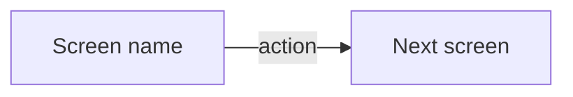

# To Wireframes

Name every **screen** the effort needs and the flows between them. A screen is one coherent view the user is looking at — a page on a site, a screen in an app, a step in a flow, a pane in a tool. Whatever the target platform calls it, the unit is the same.

Wireframes come before phases. A phase is defined by what it ships, and that stays abstract until the screens have names — the cancellation test is hard to apply to a capability and easy to apply to a screen a user can reach.

## Fidelity is a budget

Low fidelity is the point, not a shortcut. Fidelity spent on visuals buys critique of visuals: give a reviewer colour and type and they will discuss colour and type, while the flow that is missing a step goes unmentioned.

So spend the budget on **structure** and starve everything else:

- Boxes, labels, and hierarchy — what is on the screen and what dominates it
- Real content shape — a list of nine items, a title that wraps, an empty state. Placeholder lorem hides the problems that real length exposes
- Greyscale, one typeface, no imagery, no brand

Visual design has its own stage later. Naming it here keeps the reviewer's attention where it belongs.

## Derive the screens

Resolve the **effort**. Where more than one could match, ask rather than guessing.

Work from the PRD and spec under `docs/planning/<effort>/`. Walk the PRD's user stories and ask, for each one, which screen the actor is looking at when they do the thing. Stories cluster onto screens; a story that maps to no screen is a screen you have not drawn yet.

Cover the unglamorous states too — empty, loading, error, permission denied, first run. These are where scope hides, and finding them now is the reason this stage sits before phasing.

## Record the screens

Write `docs/planning/<effort>/<effort> — Wireframes.md`, beside the PRD and spec. This file is the record; the artifact built from it is the presentation.

Both exist for a reason. The artifact is what the user reacts to and it lives outside the repo, so a plan that kept only the artifact would leave the roadmap referencing screens nobody can find once the link is lost. The file is what every later stage reads.

<wireframes-template>

# <Effort name> — Wireframes

PRD: [[<effort> — PRD]] · Spec: [[<effort> — Spec]] · Artifact: <url, once published>

## Flow

## Screens

### <Screen name>

**Purpose:** one line — what the user is here to do.

**Holds:** the elements on it, in hierarchy order.

**States:** empty, loading, error, and any others this screen has.

## Story coverage

| User story | Screen |
|---|---|
| 1 | <screen name> |

</wireframes-template>

## Build the artifact

Load the `artifact-design` skill, then write a self-contained HTML file from the recorded screens and publish it with the Artifact tool. An artifact works whatever the target platform is, needs no codebase, and gives the user one link to react to.

The page holds two things:

- **A flow diagram** — the screens as nodes, the transitions as labelled edges. Artifacts render Mermaid natively, so a `<pre class="mermaid">` block is enough.
- **Every screen, laid out** — each with its name, its purpose in one line, and the states it has. Size the frames to the target platform's proportions so density reads honestly; a layout that works wide often fails narrow.

Write the published URL back into `<effort> — Wireframes.md` so the record points at its own presentation.

## Completion

The wireframes are done when **every user story in the PRD is reachable** — that is what the coverage table is for. Fill a row per story and point it at the screen where it happens. A story with no screen means a gap; a screen no story reaches means scope nobody asked for. Resolve both before moving on.

## Carry it forward

Show the user the artifact and let them react. The useful feedback is usually a missing step or a screen that turns out to be two.

Deriving the screens and building the artifact both run here, not in a subagent. The screens are settled by the user reacting to them, and the artifact is the thing they react to — sending either away would put the feedback loop across a boundary it cannot cross.

Once they are satisfied, continue in the same session: run the `to-roadmap` skill. The screens are now concrete enough to draw phase boundaries through.
