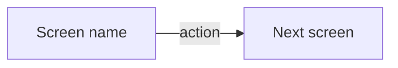

# Wireframes Format

The record lives at `docs/planning/<effort>/<effort> — Wireframes.md`, beside the PRD.

## Template

```md
# <Effort name> — Wireframes

PRD: [[<effort> — PRD]] · Spec: [[<effort> — Spec]] · Brief: [[<effort> — Design Brief]] · Canvas: <url, once the user has one>

## Flow



## Screens

### <Screen name>

**Purpose:** one line — what the user is here to do.

**Holds:** the elements on it, in hierarchy order.

**States:** empty, loading, error, and any others this screen has.

## Story coverage

| User story | Screen |
|---|---|
| 1 | <screen name> |
```

## Rules

- **This file is the source of truth.** The design brief is derived from it and the canvas is derived from the brief; both are regenerable and this is not.
- **One row per user story, keyed by the PRD's numbering.** `ui-testing` derives its minimum test list from this table, one item per row, and then one more per state named under each screen. A missing row is a screen nobody will test.
- **Every screen names its states.** Empty, loading, error, permission denied, first run. These are where scope hides, and finding them here is why this stage sits before phasing.
- **The Canvas link is filled in on reconciliation**, not on first write — there is no canvas until the user has built one.
